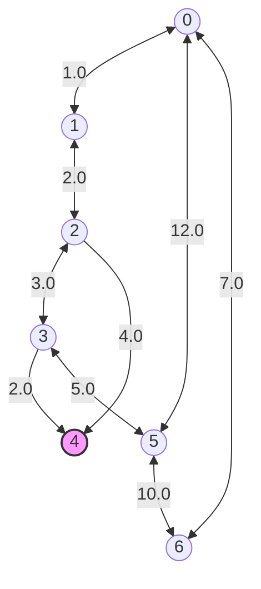

```mermaid
graph TD
    %% Node Styling
    0((0))
    1((1))
    2((2))
    3((3))
    4((4))
    5((5))
    6((6))

    %% Connections based on the Matrix
    0 <-->|1.0| 1
    0 <-->|12.0| 5
    0 <-->|7.0| 6

    1 <-->|2.0| 2

    2 <-->|3.0| 3
    2 -->|4.0| 4

    3 -->|2.0| 4
    3 <-->|5.0| 5

    5 <-->|10.0| 6

    %% Highlight Node 4 as a Sink
    style 4 fill:#f9f,stroke:#333,stroke-width:2px
```
