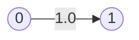
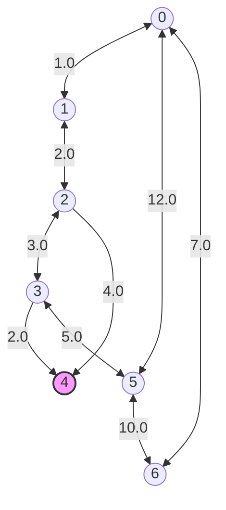

# Graph system

## Builder

The Builder is _trait_ used to build a graph. It is implemented by 3 structs :

- ManualGraphBuilder `DOING`
- FileGraphBuilder `TODO`
- OverpassGraphBuilder `TODO`

### ManuelGraphBuilder

ManualGraphBuilder is used to manualy build a graph (In order to perform tests for example).

The typical uses are the following :

```rust
// Adding vertex and edges
let graph_one = ManuelGraphBuilder::new(CoordinateType.XY)
    .add_vertex((0.0, 0.0))
    .add_vertex((0.0, 1.0))
    .add_edge(0, 1)
    .build()?;
// ----------

// With nodes and edges
let nodes = vec![
    (48.8566, 2.3522),
    (45.7640, 4.8357),
];

let edges = vec![
    (0, 1, Some(465.0)),
];

let graph_two = ManualGraphBuilder::new()
    .with_nodes(nodes)
    .with_edges(edges)
    .build()?;
// ----------
```

This will build the following graph :



Edge's weight is calculate dynamicaly and cannot be manualy set. There are two possible coordinates systems :

- GEO
  - If using latitude, longitude pairs.
- XY
  - If using 2d coordinates.

When _GEO_ is used, edge's weight will be the distance between vertices in **meters**.

When _XY_ is used, edge's weight will be the euclidian distance between vertices.

# Visualize


