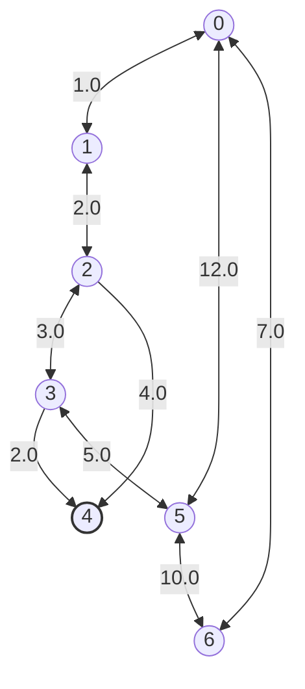
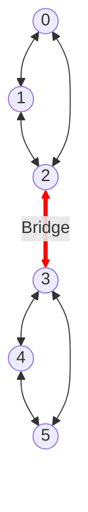
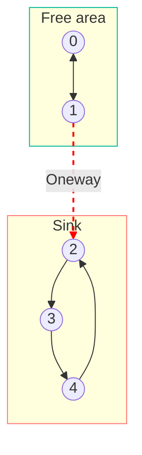
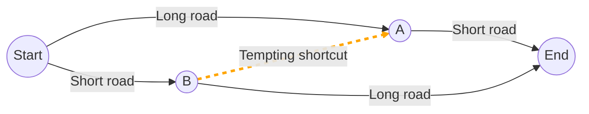
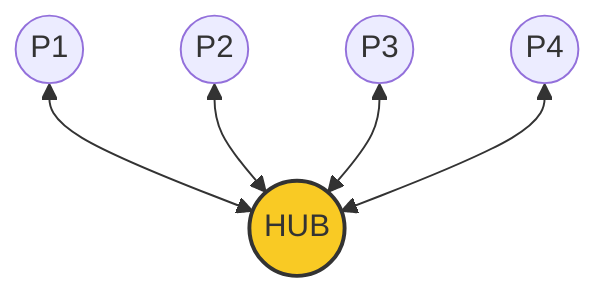
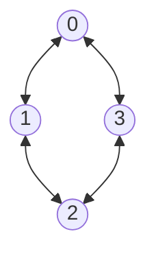

# About this doc

This doc is here to provide a visual representation of test graphs.

# Base graph

This graph is used as a base example. Not relating to a specific test.

# The dumbbell

**Usage:** This graph is used to test the Brandes algorithm. 2 denses communities are linked by a bridge.

**Tests asserts :**
  - Vertex `2 <-> 3` should have the highest Betweenness Score of the graph.
  - If we remove `2 <-> 3`, the graph is not anymore related.

# Hotel California (The Trap)

**Usage:** This graph is used to test the Trajan algorithm. We can enter the red zone, but never come back to the green one.

**Tests asserts :**
  - Trajan should find 2 components {0, 1} and {2, 3, 4}.
  - Floyd-Warshall : `Distance (2, 0)` should be `INF`.
  - Floyd-Warshall : `Distance (0, 3)` should *not* be `INF`. 

# Braess' Diamond

**Usage:** Test Dijkstra and shortcuts. A, B could be a nice shortcut.

**Tests asserts :**
  - If shortcut `B -> A` is very fast, everyone goes `S -> B -> A -> E`.
  - If `B -> A` has a low capacity, this link becomes a bottleneck.
  - In this paradox, add a link does not help but add more bottleneck.

# Grid vs Star

**Usage :** Testing Tortuosity and Resilience.

## Star (Centralized and Fragile)

- HUB has a maximum centrality.
- Removing the HUB destoys everything.

## The grid (Decentralized / Resilient)

- Removing a node does not affect accessibility.

